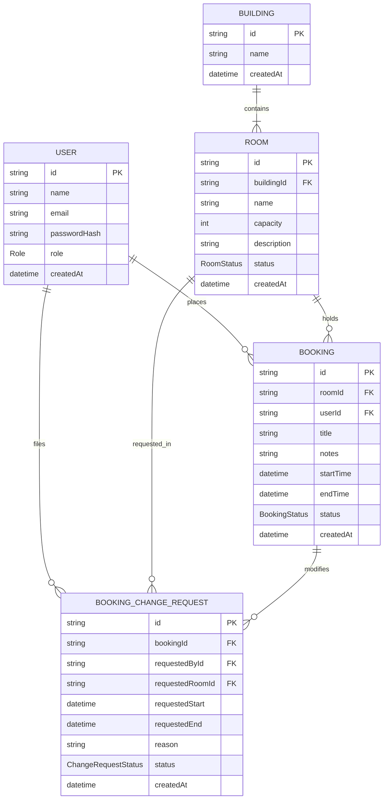

# 🚪 RoomFlow — Premium Full-Stack Workspace Booking Engine

RoomFlow is a state-of-the-art workspace booking engine designed for multi-building corporate offices. The platform features an intelligent time-centric conflict validation engine, role-based security clearances (IT Admin, Operations Manager, and Employee), and a stunning slate-and-indigo glassmorphism dark-themed portal with an interactive **FullCalendar** scheduler, supporting direct **drag-and-drop rescheduling**.

The entire ecosystem is containerized with **Docker Compose**, orchestrated alongside a high-performance **Nginx** reverse proxy gateway.

---

## 🎨 Design & Visual Aesthetic

RoomFlow is built on top of a curated slate-and-indigo glassmorphic aesthetic:
* **Rich Glassmorphism**: Cards and dialog panels feature semi-translucent backdrops (`backdrop-blur-md`), dark slate overlays, and glowing borders (`border-white/5` with hover indigo-500 box shadows).
* **Curated Harmonious Gradients**: Sleek, energetic primary buttons and badges with linear indigo-to-violet background transitions.
* **Micro-Animations**: Spring-like hover effects on active elements, scaling cues, and animated server state notifications.
* **Dark Mode Custom Calendar**: Overridden FullCalendar layout rules to seamlessly match the corporate dark workspace design.

---

## 🏗️ Relational Data Model (Prisma / PostgreSQL)

RoomFlow utilizes a clean, normalized relational model with automatic migrations and seed populating.



---

## 🔐 Security clearances & Role Behaviors

The system enforces strict role-based actions on both the frontend visual layer and global backend route controllers:

| Access Role | Clearance Level | Key System Capabilities |
| :--- | :--- | :--- |
| **`USER`** <br>*(Employee)* | **Standard Access** | • Filter active workspaces by building.<br>• Browse live room calendars.<br>• Click-and-drag slots to book meeting rooms.<br>• View own bookings & file rescheduling/change requests. |
| **`ROOM_ADMIN`** <br>*(Operations Manager)* | **Operations Control** | • Add/Modify office buildings and meeting rooms.<br>• Toggle workspace status (ACTIVE vs. MAINTENANCE).<br>• Master Operations Calendar with **drag-and-drop rescheduling**.<br>• Override bookings, cancel slots, or create admin blocks.<br>• Approve or Reject pending employee change requests. |
| **`ADMIN_IT`** <br>*(System Controller)* | **Super Administrator** | • Complete User account CRUD management (add, edit, delete, assign roles).<br>• Storage Provider Controls (switch backend upload strategies between local paths, S2/S3 cloud buckets, or Google Drive folder APIs). |

---

## ⚡ Logical Core: Overlap Conflict Engine

The booking engine enforces absolute scheduling safety. A reservation is rejected as a conflict if:
$$\text{Requested Start} < \text{Existing End} \quad \text{AND} \quad \text{Requested End} > \text{Existing Start}$$

This is query-optimized in the backend core layer (`bookings.service.ts`):
```typescript
const conflict = await this.prisma.booking.findFirst({
  where: {
    roomId,
    status: BookingStatus.BOOKED,
    id: { not: excludeBookingId },
    AND: [
      { startTime: { lt: endTime } },
      { endTime: { gt: startTime } },
    ],
  },
});
```

---

## 🛠️ Technology Stack

* **Frontend**: Next.js 15 (Turbopack), Tailwind CSS v4, Lucide React, Axios, React Hot Toast, FullCalendar v6.
* **Backend**: NestJS, Prisma ORM, JWT Passport Strategies, Class-Validators.
* **Database**: PostgreSQL 16 (persistent volumes).
* **Infrastructure**: Nginx (Reverse Proxy Gateway), Multi-stage Docker files, Docker Compose.

---

## 📂 Project Architecture Layout

```bash
RoomFlow/
├── backend/                  # NestJS Web Service
│   ├── src/
│   │   ├── auth/             # Passport JWT & Decrypt
│   │   ├── buildings/        # Buildings Module
│   │   ├── rooms/            # Rooms Module
│   │   ├── bookings/         # Booking Validation Core
│   │   ├── users/            # Accounts CRUD Registry
│   │   └── storage/          # Local / S3 / GDrive Abstractions
│   ├── prisma/
│   │   ├── schema.prisma     # Relational Database Models
│   │   └── seed.ts           # Auto-Seeding Script
│   └── Dockerfile            # Multi-stage Backend Image Build
│
├── frontend/                 # Next.js 15 Client App
│   ├── src/
│   │   ├── app/              # Custom Routing Pages
│   │   ├── components/       # Card, Button, Modal, Sidebar, Header
│   │   ├── lib/              # Axios Interceptor, Auth Context
│   │   └── types/            # Shared TypeScript Interfaces
│   ├── tsconfig.json         # Path Aliases Config (@/*)
│   └── Dockerfile            # Multi-stage Frontend Image Build
│
├── nginx.conf                # API Gateway Reverse Routing Proxy
├── docker-compose.yml        # Multi-container System Orchestration
└── README.md                 # System Documentation Manual
```

---

## 🚀 Quick Start Guide

Ensure you have **Docker Desktop** running, then execute these commands in your shell to bootstrap and launch RoomFlow instantly:

### Step 1: Run the Database Container
Spin up the PostgreSQL 16 server in the background:
```bash
docker compose up -d postgres
```

### Step 2: Run Prisma Migrations and Seed Data
Navigate to the backend directory, install packages, compile the database tables, and run the developer seed script:
```bash
cd backend
npm install
npx prisma migrate dev --name init
npx prisma db seed
```
This initializes the table entities and creates our cheat-sheet development accounts:
* **System Controller**: `admin@roomflow.local` / `password123`
* **Operations Manager**: `manager@roomflow.local` / `password123`
* **Regular Employee**: `user@roomflow.local` / `password123`

### Step 3: Build & Launch the Container Network
Navigate back to the project root and spin up the complete Full-Stack ecosystem:
```bash
cd ..
docker compose up --build -d
```

### Step 4: Access RoomFlow
* **`http://localhost`** — Served through Nginx. Access the Next.js interface, log in, browse, drag & drop calendar blocks, and check conflict engines in real-time.
* **`http://localhost/api`** — REST endpoints routed natively to NestJS.
